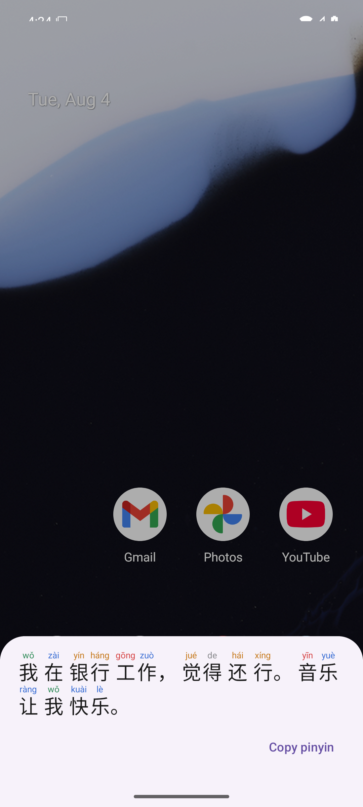
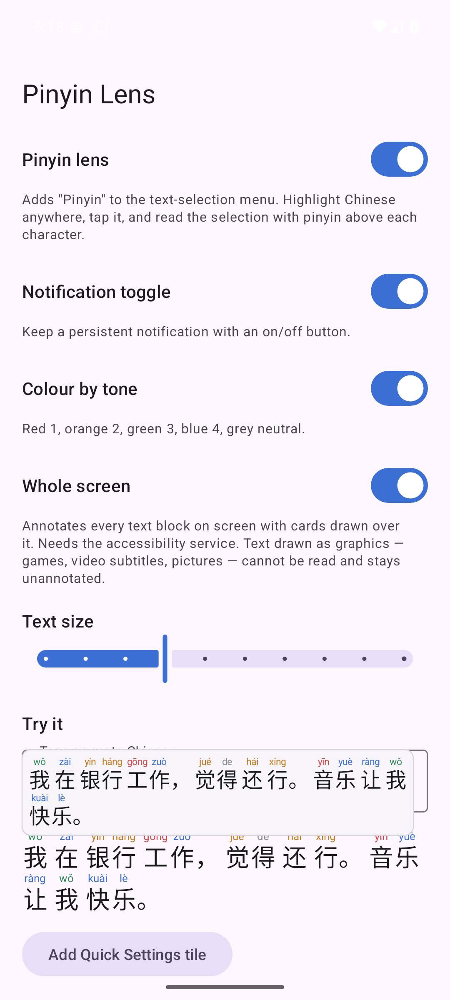

# Pinyin Lens

Reads Chinese text with pinyin set above each character, on stock Android — no
root and no system font replacement.

Two modes: **selection** (highlight text, tap Pinyin) needs no special
permissions and is the accurate one; **whole screen** annotates everything
readable in the active window and needs an accessibility service, with the
trade-offs set out below.

Built for ColorOS 16 (Android 16), where the old zFont-style font-swap route is
closed: ColorOS only accepts signed Theme Store font packages, and the root
alternative now needs a Deep Testing bootloader unlock.



## How it works

Instead of replacing the system font, the app registers an `ACTION_PROCESS_TEXT`
activity. That puts a **Pinyin** entry in Android's text-selection toolbar, next
to Copy and Share. Highlight Chinese in any app that uses standard text
selection — WeChat, a browser, a reader, notes — tap Pinyin, and the selection
comes back annotated in a bottom sheet.

Because the annotation is rendered into our own surface, nothing depends on the
host app's font, size, or background — the failure mode that makes screen-overlay
approaches look wrong in half the apps they run in.

### The toggle

Turning the lens off calls `setComponentEnabledSetting` on the
`ProcessTextActivity` component, which removes **Pinyin** from the selection
toolbar system-wide. Turning it on puts it back. Two controls drive that same
state:

- a persistent, silent notification with a Turn on / Turn off action
- a Quick Settings tile

Note the notification is *not* a foreground-service notification. Nothing needs
to stay running — the lens is a component flag, and the notification's
`PendingIntent` wakes the app only when tapped. There is no background process
for ColorOS's battery manager to kill.

### Polyphones and word grouping

This is the part a baked-in ruby font cannot do, because by the time text
reaches a font the word boundaries are gone.

`银行` is `yín háng`, not `yín xíng`; `觉得` is `jué de`, not `jué dé`. The
engine runs forward maximum matching over the full CC-CEDICT vocabulary, and
falls back to per-character readings only where no word matches.

Knowing the boundaries buys a second thing: the renderer groups words visually
and refuses to break a line mid-word, so `我在银行工作` sets as
`我 / 在 / 银行 / 工作` rather than an undifferentiated run of characters.

## Building the dictionary

The assets are generated, not committed by hand:

```
python3 tools/build_dict.py
```

- `chars.txt` — 44,348 characters, from Unihan `kMandarin` (the preferred reading)
- `words.txt` — 179,572 words, from CC-CEDICT

Every headword is kept, because the segmenter needs the whole vocabulary to
find word boundaries. But only 19,731 of them carry a *reading*: the other
159,841 pronounce exactly as their characters do individually, so the line
holds the word alone and the reading comes from `chars.txt`. `中国` needs no
reading; `银行` does.

Both files are sorted in **UTF-16 code-unit order**, not Python's default
code-point order. The app binary-searches them with Kotlin's `String.compareTo`,
which compares UTF-16 units — and the two orderings disagree for supplementary
characters. `tools/verify_engine.py` asserts the ordering, because a regression
there would silently break lookups for a subset of entries.

### Why not a HashMap

180k entries as `HashMap<String, String>` would run an estimated 25–30 MB of
heap. The selection-menu entry starts a fresh process each time it's tapped, so
that cost would be paid over and over.

`SortedTable` instead holds each file as one string plus an index of line
offsets: a measured **3.2 MB** for both tables (words 2.5 MB, chars 0.7 MB),
and a lookup is ~18 comparisons. Whole-app Java heap with both dictionaries
resident measures ~20 MB PSS, most of which is AndroidX and Material rather
than data.

## Building the app

Toolchain, on macOS without Android Studio:

```
brew install openjdk@17                       # NOT the temurin cask - its .pkg
                                              # installer needs a sudo password
brew install --cask android-commandlinetools
export JAVA_HOME=/opt/homebrew/opt/openjdk@17
export ANDROID_HOME="$HOME/Library/Android/sdk"
yes | sdkmanager --sdk_root="$ANDROID_HOME" --licenses
sdkmanager --sdk_root="$ANDROID_HOME" platform-tools "platforms;android-36" "build-tools;36.0.0"
```

Then:

```
./build.sh                    # assembleDebug, with the env already set
./build.sh assembleRelease
adb install -r app/build/outputs/apk/debug/app-debug.apk
```

Debug APK is ~7 MB, release ~3 MB.

## Verified on an Android 36 emulator

Screenshots in `docs/`: `sheet-light.png`, `sheet-dark.png` (lifted tone
palette), `sheet-wrapping.png` (four-line wrap), `main.png`.

Confirmed on device: polyphones render correctly in actual pixels — 银行
`yín háng`, 觉得 `jué de`, 首都 `shǒu dū` (not `dōu`), neutral tones greyed;
lines break between words, never inside one; toggling the switch adds and
removes `ProcessTextActivity` from the system's `PROCESS_TEXT` resolvers; the
notification's text follows the lens state.

## Measured

Software-rendered (swiftshader) at 1080×2400, 420dpi — a real phone should beat
these:

| | |
|---|---|
| Cold launch of the sheet, to first frame | 323–416 ms |
| Both dictionaries resident | 3.2 MB |
| Whole-app Java heap, dictionaries loaded | ~20 MB PSS |
| Debug APK / release APK | 8.3 MB / 2.7 MB |

## Tests

`tools/verify_engine.py` reimplements the Kotlin segmentation in Python and runs
it against the shipped assets, so polyphone and word-boundary regressions
surface without an emulator. It also asserts the asset sort order.

```
python3 tools/verify_engine.py
./build.sh testDebugUnitTest        # SortedTable's binary search
```

## Whole screen



Switch on "Whole screen" and the app explains the trip to system settings
before sending you there; grant the service, press Back, and it turns itself on.
The tile and the notification's **Screen** action toggle it thereafter.

A **How to use** button next to the title reopens the same instructions at any
time, and they are shown once automatically on first launch
(`docs/help-welcome.png`, `docs/help-overlay-setup.png`). The setup dialog also
covers the two things that most often block it: Android's "restricted settings"
gate on sideloaded apps, and ColorOS auto-start plus battery restrictions.

What it can and cannot do is set by what an accessibility service is given. A
node exposes its text and a bounding box — not glyph positions, font, size or
colour. In-place annotation is therefore impossible, so each block is *covered*
by an opaque card and re-rendered. That has consequences that are structural,
not bugs to be fixed later:

- Cards look like cards. They do not blend into the host app.
- Ruby text is taller than plain text, so a card overruns the block it covers
  and can obscure whatever sits below it.
- Where two cards would collide the smaller is dropped, so a dense screen is
  annotated only in part. Turning **Whole screen card size** down shrinks the
  cards and reduces both the spill and the collisions.
- While the screen is *moving* the cards hide rather than linger over content
  that has scrolled away, and come back ~180 ms after it settles. Only a scroll
  or a window change counts as movement — apps emit content-changed events
  constantly for animations and live content, and reacting to those made an
  idle screen blink. A refresh that yields the same text in the same places
  redraws nothing at all.
- Text that isn't a text node — canvas drawing, games, video subtitles, text
  inside images — cannot be seen at all and stays unannotated.
- **The grant is often cleared by an app update.** Verified on stock Android 16
  that an in-place update *keeps* it, so this is device behaviour: ColorOS
  revokes accessibility on update, and Android 13+ re-arms its
  restricted-settings block because each sideloaded install counts as a new
  unknown-source install.

  No app can restore this itself — there is no API to enable your own
  accessibility service, deliberately, because that is exactly what malware
  would use. What the app does instead is notice: after an update it posts a
  notification and shows a dialog explaining the fix, with a button that jumps
  to the accessibility list (where Pinyin Lens appears first under *Downloaded
  apps*). If the toggle is greyed out, that is the restricted-settings block:
  Settings → Apps → Pinyin Lens → ⋮ → Allow restricted settings.

  From a computer, this re-grants it in one step without touching Settings:

  ```
  adb shell settings put secure enabled_accessibility_services \
    io.tr8.pinyinlens/io.tr8.pinyinlens.overlay.PinyinAccessibilityService
  adb shell settings put secure accessibility_enabled 1
  ```

  The permanent fix is distribution rather than code: an app installed from a
  source Android trusts is not subject to the restricted-settings gate.

Selection mode is independent of all this and keeps working if you leave the
overlay off.

## Reporting bugs

Email **yy@yyhsk.com**. The app has a **Report a bug** button at the bottom of
its settings screen which opens a message pre-filled with the version, device,
Android release and which modes were on — the things a report is useless
without.

## Updates

The app checks this repository's releases on launch (switchable) and on demand
from **Check for updates now**. If a newer tag exists it offers the release
APK, downloads it, and hands it to the system installer.

It cannot install silently, and no sideloaded app can: only a device owner or
system app may install packages without confirmation, so you tap **Update** at
the end. The install also fails unless the download carries the same signing
key as the installed app — which is precisely what stops a substituted APK
taking over the package, so it is a feature rather than an obstacle.

Android additionally requires this app to be allowed as an install source. The
updater checks that *before* downloading and explains it, rather than failing
at the end of a download.

Publishing a new version:

```
./build.sh assembleRelease
gh release create v0.4.0 app/build/outputs/apk/release/app-release.apk \
  --title "Pinyin Lens 0.4.0" --notes "..."
```

The updater picks the first `.apk` asset that is not a debug build, compares
the tag against the installed `versionName` numerically (so 0.10.0 correctly
beats 0.9.0), and shows the release notes in the prompt.

## Installing on the phone

Built APKs land in `dist/`. No native code, so one APK covers every ABI;
minSdk 26, targetSdk 36.

Easiest, over USB with developer options + USB debugging on:

```
adb install -r dist/PinyinLens-0.3.0-release.apk
```

Or copy the APK to the phone and open it. ColorOS blocks that by default:
**Settings → Apps → Special app access → Install unknown apps**, and allow it
for whichever app opens the file (Files, or your browser). ColorOS also runs its
own scan on first install and offers "Install anyway".

After installing, open the app once to grant the notification permission and
add the Quick Settings tile.

### Signing

`release.keystore` and `keystore.properties` are gitignored and **must be backed
up**. Android identifies an app by its signing key: lose them and future builds
will refuse to install over this one, forcing an uninstall (which wipes
settings). The key is a self-signed RSA-4096, valid 30 years.

## Roadmap

**v0.1 — selection mode (this build).** Highest fidelity, widest app coverage,
no special permissions beyond notifications. Includes:

- pinyin over each character, with context-correct polyphones
- visual word grouping, and no line breaks mid-word
- optional tone colouring, with separate light and dark palettes
- two independent size controls: highlight sheet 12–48sp, whole-screen cards
  40–200% of the size the host app appears to be using
- notification toggle and Quick Settings tile, one-tap tile install on
  Android 13+
- copy the reading as plain text
- toggle state survives reboot; the notification is re-posted on boot

**v0.2 — tap-to-annotate.** An `AccessibilityService` reads the text node you
tapped and overlays just that block. Removes the two-tap flow. Costs: the
Android 13+ restricted-settings dance for sideloaded apps, ColorOS auto-start
and battery exemptions, and a service that ColorOS may disable on reboot.

**v0.2 — whole-screen overlay (shipped in 0.2.0).** An `AccessibilityService`
reads every text node in the active window and draws an opaque annotation card
over each block containing Chinese. See "Whole screen" below.

**Not built: tap-to-annotate.** A middle mode that annotates only the block you
tap. Cheaper than the full overlay and free of its overlap problem; worth
adding if the full screen proves too noisy in practice.

## Licensing

The word list is derived from [CC-CEDICT](https://www.mdbg.net/chinese/dictionary?page=cc-cedict),
which is **CC BY-SA 4.0**. Redistributing `words.txt` — including inside an APK
— carries the attribution and share-alike obligations. See `NOTICE`.

Character readings come from the Unicode Character Database (Unihan), under the
[Unicode License](https://www.unicode.org/license.txt).
